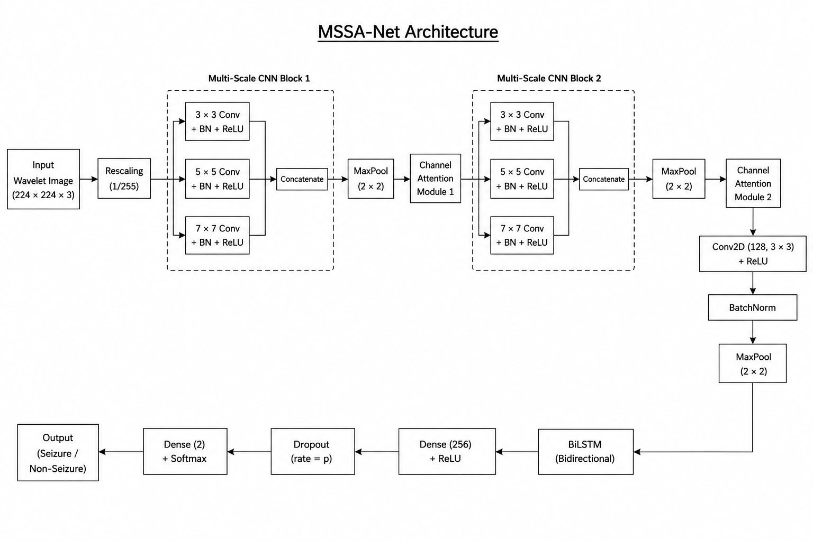
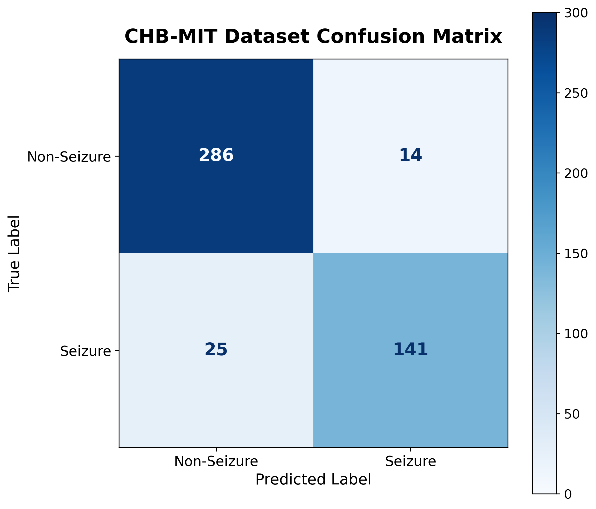
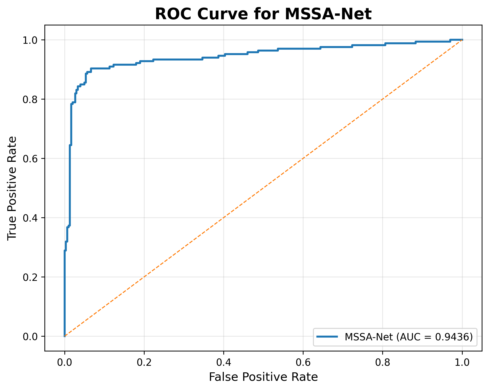
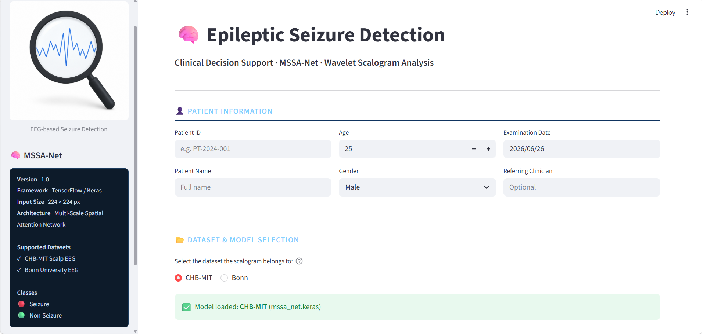

# 🧠 MSSA-Net: Epileptic Seizure Detection using Multi-Scale CNN, Channel Attention, and BiLSTM


A deep learning framework for **automatic epileptic seizure detection** from EEG signals using **Wavelet Scalograms** and a **Multi-Scale CNN with Channel Attention and BiLSTM (MSSA-Net)**.

The proposed system transforms EEG signals into time-frequency representations using Continuous Wavelet Transform (CWT), extracts multi-scale spatial features through convolutional blocks, enhances important feature channels using an attention mechanism, and models temporal dependencies with BiLSTM for accurate seizure classification.

---

# 📌 Project Overview

Epilepsy is one of the most common neurological disorders, affecting millions of people worldwide. Manual analysis of Electroencephalogram (EEG) recordings is time-consuming and requires experienced neurologists.

This project proposes an automated seizure detection system that combines:

- Continuous Wavelet Transform (CWT)
- Wavelet Scalograms
- Multi-Scale CNN
- Channel Attention Module
- BiLSTM
- Dense Classification Layer

The framework is evaluated on both:

- CHB-MIT Scalp EEG Dataset
- Bonn EEG Dataset

---

# ✨ Features

- EEG preprocessing
- Wavelet Scalogram generation
- Multi-scale feature extraction
- Channel Attention mechanism
- BiLSTM temporal learning
- Binary seizure classification
- CHB-MIT dataset support
- Bonn dataset support
- Streamlit-based prediction interface
- ROC Curve and Confusion Matrix visualization

---

# 🏗 Proposed Architecture

<p align="center">

</p>

The proposed MSSA-Net consists of:

1. EEG Signal Input
2. Continuous Wavelet Transform
3. Wavelet Scalogram Generation
4. Multi-Scale CNN Blocks
5. Channel Attention Module
6. Additional Convolution Block
7. BiLSTM Layer
8. Dense Layer
9. Softmax Classification

---

# 🔄 Workflow

```
EEG Signal
      │
      ▼
Preprocessing
      │
      ▼
Continuous Wavelet Transform
      │
      ▼
Wavelet Scalogram
      │
      ▼
Multi-Scale CNN
      │
      ▼
Channel Attention
      │
      ▼
BiLSTM
      │
      ▼
Dense Layer
      │
      ▼
Seizure / Non-Seizure
```

---

# 📂 Dataset

## CHB-MIT Dataset

- Pediatric scalp EEG recordings
- EDF format
- Multiple seizure events
- Wavelet scalograms generated from EEG segments

---

## Bonn Dataset

Binary classification created from:

- Seizure samples
- Non-seizure samples

Balanced Dataset:

| Class | Images |
|-------|--------:|
| Seizure | 2300 |
| Non-Seizure | 2300 |

---

# 📁 Repository Structure

```
MSSA-Net-Epileptic-Seizure-Detection
│
├── app.py
├── requirements.txt
├── README.md
│
├── src
│   ├── preprocessing
│   ├── models
│   ├── training
│   ├── evaluation
│   └── utils
│
├── notebooks
│
├── diagrams
│   ├── figure
│   ├── script
│   └── UML
│
├── outputs
│   ├── chb_results
│   ├── bonn_results
│   └── graphs
│
└── base_paper
```

---

# ⚙ Installation

Clone the repository

```bash
git clone https://github.com/Sanketmandhare1805/MSSA-Net-Epileptic-Seizure-Detection.git

cd MSSA-Net-Epileptic-Seizure-Detection
```

Create virtual environment

```bash
python -m venv mssa_env
```

Activate

Windows

```bash
mssa_env\Scripts\activate
```

Install dependencies

```bash
pip install -r requirements.txt
```

---

# 🚀 Training

Train MSSA-Net on CHB-MIT

```bash
python src/training/train.py
```

Train MSSA-Net on Bonn

```bash
python src/training/train_bonn.py
```

---

# 📊 Model Evaluation

CHB-MIT

```bash
python src/evaluation/evaluate_model.py
```

Bonn

```bash
python src/evaluation/evaluate_bonn_model.py
```

Outputs include:

- Classification Report
- Confusion Matrix
- ROC Curve
- AUC Score

---

# 💻 Streamlit Application

Launch the web application

```bash
streamlit run app.py
```

Features

- Upload EEG Wavelet Scalogram
- Select CHB-MIT or Bonn Model
- Predict Seizure / Non-Seizure
- Confidence Score
- Probability Visualization

---

# 📈 Results

### CHB-MIT Dataset

- High seizure detection performance
- ROC Curve
- Confusion Matrix
- Classification Report

<p align="center">


</p>

---

### Bonn Dataset

- Validation Accuracy ≈ **98.6%**
- ROC-AUC ≈ **0.996**

---

# 📷 Application Preview

<p align="center">

</p>

---

# 🛠 Technologies Used

- Python
- TensorFlow
- Keras
- NumPy
- Pandas
- OpenCV
- PyWavelets
- Matplotlib
- Scikit-learn
- Streamlit

---

# 🔬 Future Improvements

- Multi-class seizure classification
- Real-time EEG streaming
- Edge deployment
- Explainable AI (Grad-CAM)
- Patient-specific adaptation
- Mobile application

---

# 📚 References

1. CHB-MIT Scalp EEG Database
2. Bonn University EEG Dataset
3. TensorFlow Documentation
4. PyWavelets Documentation

---

# 📄 License

This project is released under the **MIT License**.

---

# 👨‍💻 Author

**Sanket Mandhare**

GitHub: https://github.com/Sanketmandhare1805

---

## ⭐ Support

If you find this project useful, consider giving it a **Star ⭐** on GitHub.